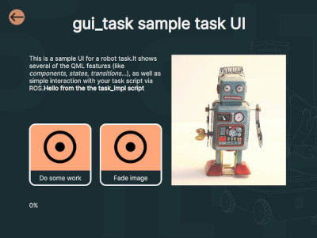
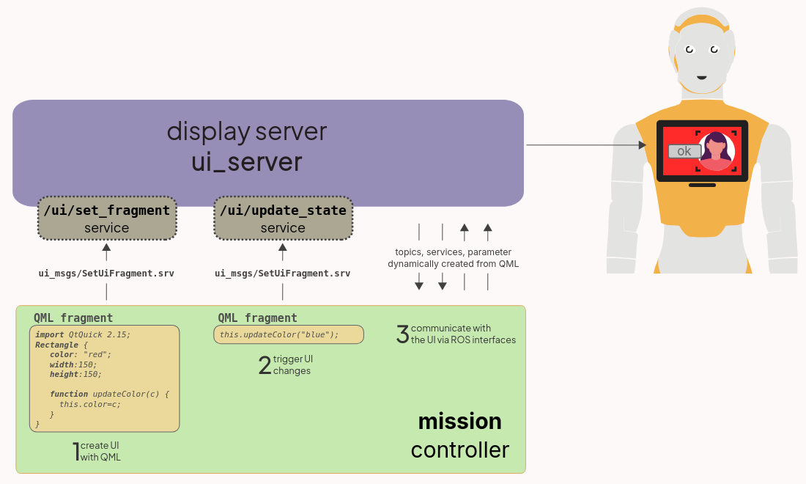

# UI Server



ROS 2 UI 'server' that manage user interfaces.

Uses QML as UI description language.

The node exposes two services to set the UI fragment to be displayed, and
to update the state of the current UI by executing javascript snippets.



## ROS API

### Usage

To start in windowed mode:

```bash
ros2 run ui_server ui_server
```

To start in fullscreen mode:

```bash
ros2 run ui_server ui_server --fullscreen
```

### Services

- `/ui/set_fragment` (`ui_msgs/SetUiFragment`): instructs the UI server to
  render the provided QML snippet onto the display. This service has two fields:
   - `qml_import_path` (optional): path to a QML module that is added to the import
     path of the qml engine.
   - `qml_fragment` (optional): a QML string, to be rendered.

The qml fragment must include all required imports. It can optionally include
QML components defined in the `qml_import_path` (if provided).

Note that import paths are not removed at the end of the service call. As such
you can for instance load one (or several) QML modules (for instance, with a
library of QML components you want to share across several applications), and
then refer to these components without having to re-import the path everytime.

- `/ui/update_state` (`ui_msgs/SetUiFragment`): use this service to update the
  state of the UI. Typically, you pass a small javascript snippet, to be executed in
  the context of the current QML UI.

  Importantly, any javacript function call **must** be prefixed with `this.`,
  as visible in the example below.

  Note that calling this service without first calling `/ui/set_fragment` will
  cause an error.

## Testing

### Simple UI fragment

Once running, executing the following service call should display a red
rectangle, 150x150px, in the top left corner of the external display:

```
ros2 service call /ui/set_fragment ui_msgs/srv/SetUiFragment "qml_import_path: ''
qml_fragment: 'import QtQuick 2.15; Rectangle{color:\"red\";width:150;height:150}'"
```

### Updating state

For instance, assuming the following QML fragment has been set:

```
ros2 service call /ui/set_fragment ui_msgs/srv/SetUiFragment "qml_import_path: ''
qml_fragment: 'import QtQuick 2.15; Rectangle{color:\"red\";width:150;height:150;function updateColor(c){this.color=c}}'"
```

You can then call the following service to change the color of the rectangle to
blue:

```
ros2 service call /ui/update_state ui_msgs/srv/SetUiFragment "qml_fragment: 'this.updateColor(\"blue\")'"
```


